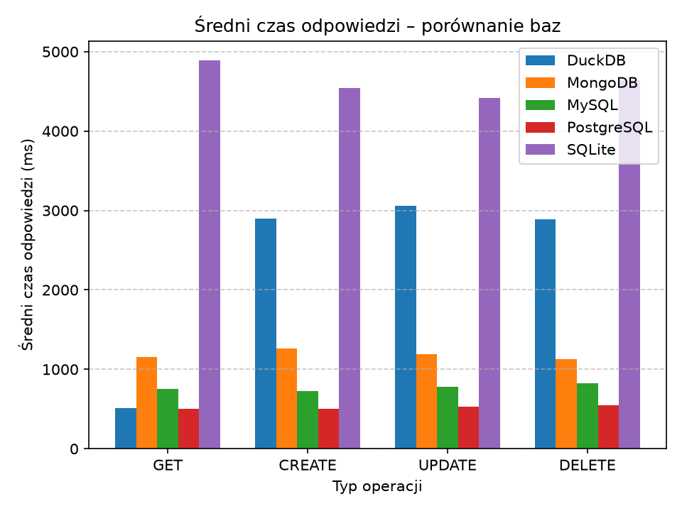
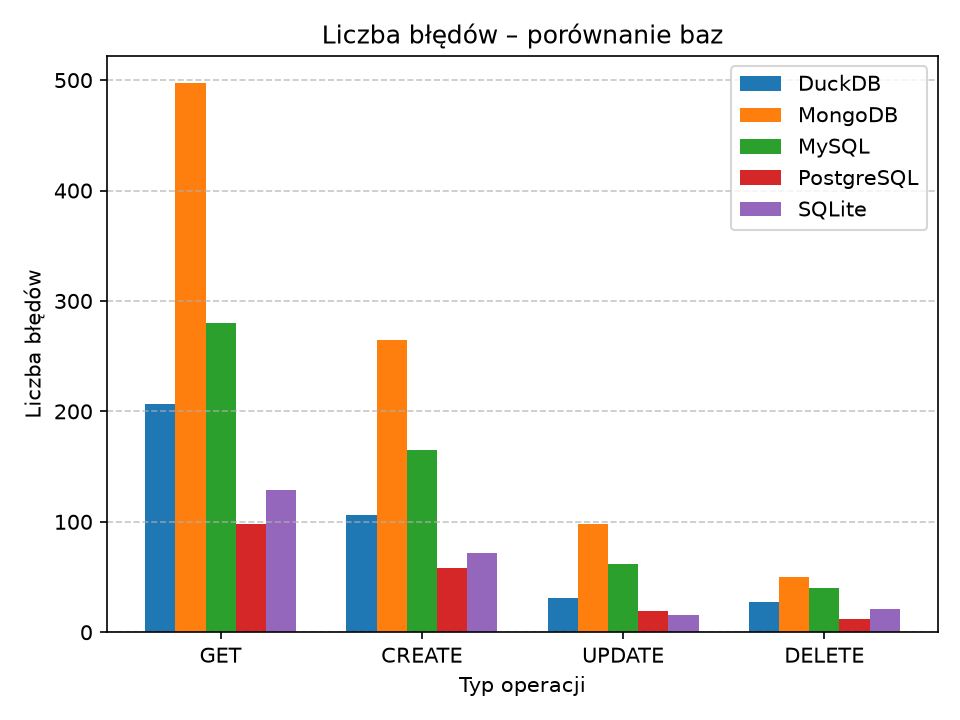

# Notes API – Async Performance Comparison

[](https://python.org)
[](https://fastapi.tiangolo.com)
[](LICENSE)

Aplikacja **FastAPI** do zarządzania notatkami, stworzona w celu porównania wydajności pięciu różnych baz danych w środowisku asynchronicznym.  
Każda baza udostępnia identyczne endpointy REST (CRUD), co umożliwia testy obciążeniowe i analizę czasów odpowiedzi.

## 🗃️ Obsługiwane bazy danych

| Baza | Sterownik | Tryb async |
|------|-----------|------------|
| PostgreSQL | `asyncpg` | ✅ natywny |
| MySQL | `asyncmy` | ✅ natywny |
| SQLite | `aiosqlite` | ✅ natywny |
| DuckDB | `duckdb-engine` | ⚠️ thread pool |
| MongoDB | `motor` | ✅ natywny |

## 🚀 Endpointy

Każda baza wystawia poniższe operacje pod prefiksem `/{baza}/notes`:

- `GET /` – lista notatek (paginacja `skip`/`limit`)
- `GET /{id}` – pojedyncza notatka
- `POST /` – utwórz notatkę
- `PUT /{id}` – zaktualizuj notatkę
- `DELETE /{id}` – usuń notatkę

Przykład dla PostgreSQL: `http://localhost:8000/postgresql/notes/`

Pełna dokumentacja interaktywna dostępna pod `/docs` (Swagger UI) po uruchomieniu.

## ⚙️ Szybki start

### Wymagania

- Python 3.12+
- Docker i Docker Compose (dla baz zewnętrznych)
- `pip` i wirtualne środowisko (zalecane)

### Instalacja

```bash
git clone https://github.com/twoj-nick/notes-api-comparison.git
cd notes-api-comparison
python -m venv venv
source venv/bin/activate   # Linux / WSL
# venv\Scripts\activate    # Windows
pip install -r requirements.txt
```


## 📈 Wyniki testów obciążeniowych

Poniżej przedstawiono wykresy porównawcze średnich czasów odpowiedzi oraz liczby błędów dla każdej bazy.

### Średni czas odpowiedzi (ms)



### Liczba błędów


